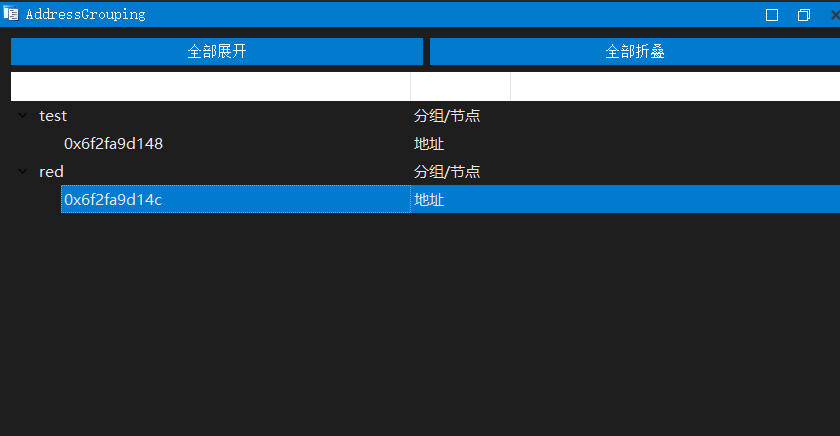

[中文说明请点击这里 (README_zh.md)](README_zh.md) 

# AddressGrouping Plugin

## Introduction

**AddressGrouping** is an advanced grouping and workflow analysis plugin for IDA Pro. It supports multi-level grouping, address management, comments, node highlighting, and more, greatly improving efficiency for reverse engineering and code organization.

## Main Features

- Multi-level tree structure: any node can have child nodes (group, address, or custom node)
- Both addresses and nodes support comments, displayed in the right column
- Right-click to mark nodes with red, green, yellow, or gray (all soft colors), and persistently save the color
- One-click to clear all color markings
- Plugin window supports expand/collapse all; group nodes can expand all their children with one click
- All data (groups, addresses, comments, colors, etc.) are automatically saved in the IDA database and migrate with the idb/i64 file
- Supports quick add group/address from the main IDA right-click menu
- Double-click address node in the plugin window to jump to the address

## Installation

1. Requirements:
   - IDA Pro 7.4 or above (7.6+ recommended, PyQt5 support required)
   - Python 3.x
   - PyQt5 installed (bundled with IDA or installed manually)
2. Copy `AddressGrouping.py` to the `plugins` directory of your IDA installation
3. Start IDA, the plugin will auto-load and pop up the main window

## Usage

- **Main Window**:
  - Right-click blank area: add group, clear all colors
  - Right-click group/node/address: add child node, set comment, mark color, delete node
  - Right-click group node: expand all child nodes of this group
  - Top buttons: expand/collapse all
  - Double-click address node: jump to the address in IDA
- **IDA Main View Right-Click**:
  - In disassembly/pseudocode view, right-click to quickly add group or address
- **Comments & Colors**:
  - Comments and color marks are persistently saved and migrate with the IDA database

## Highlights

- Multi-level grouping, perfect for workflow/call chain analysis
- Node comments and soft color highlighting, great for team collaboration and personal organization
- All data is auto-saved, no need for manual export/import
- Good compatibility, supports multiple IDA versions

## Compatibility

- Supports IDA Pro 7.4 and above (7.6+ recommended)
- Works on Windows/Linux/Mac
- Requires PyQt5

## License

This plugin is open-sourced under the MIT License. Contributions and forks are welcome!

## Contact & Feedback

For issues, suggestions, or bug reports, please submit an Issue on the GitHub repository. 